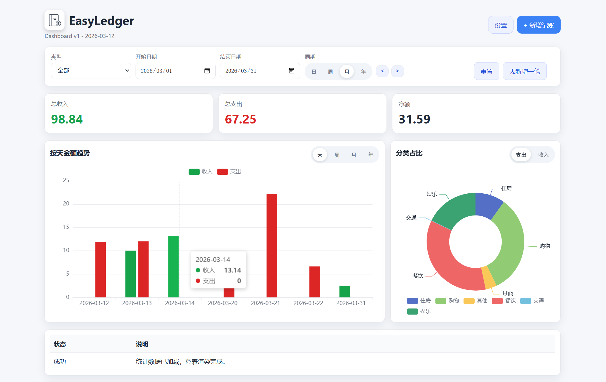

# EasyLedger

EasyLedger 是一个基于 Spring Boot + Thymeleaf 的轻量级记账应用，强调快速录入、清爽仪表盘与实用统计。

## 功能亮点
- 新增 / 编辑 / 删除 / 查看记账记录（收入 / 支出）
- 仪表盘支持日期范围筛选与周期快速切换
- 趋势柱状图与分类占比饼图
- 最近流水与完整流水记录页（按周期分组 + 小计）
- 备注关键词搜索，按类型 / 分类筛选
- 主题浅色/暗夜切换与仪表盘图表显示开关

## 页面入口
- 仪表盘：`/transactions`
- 新增记账：`/transactions/new`
- 记账统计：`/transactions/records`
- 流水详情：`/transactions/{id}`
- 设置：`/settings`

## 技术栈
- Java 17
- Spring Boot 3.2.x
- Thymeleaf
- MyBatis-Plus
- MySQL 8.x
- ECharts（CDN）

## 快速开始

### 环境要求
- JDK 17
- MySQL 8.x
- Maven（或使用 Maven Wrapper）

### 1）创建数据库并初始化表
创建数据库 `easy_ledger`，然后执行：

```
-- 在 MySQL 中执行
SOURCE src/main/resources/sql/init.sql;
```

### 2）配置数据库
按需修改 `src/main/resources/application.yml`：
- URL：`jdbc:mysql://localhost:3306/easy_ledger`
- 用户名：`root`
- 密码：通过环境变量 `DB_PASSWORD` 提供

也可以用环境变量覆盖密码：
- `DB_PASSWORD`（推荐用于本地/CI）

### 3）启动项目
Windows：

```powershell
./mvnw.cmd spring-boot:run
```

macOS / Linux：

```bash
./mvnw spring-boot:run
```

访问：`http://localhost:8080/transactions`

## 截图
建议将截图放在 `docs/images/` 目录，然后在这里引用：

```


```

## 说明
- 图表使用 ECharts CDN，如网络受限可能无法渲染。
- 主题与图表开关保存在 `localStorage`：
  - `easyledger-theme`：`light` / `dark`
  - `easyledger-show-charts`：`true` / `false`

## 数据库结构
项目包含两张核心表：
- `ledger_category`
- `ledger_transaction`

详情见 `src/main/resources/sql/init.sql`。

## 目录结构（关键部分）
```
src/main/java/com/bbww/easyledger
  controller/           Web controllers
  entity/               Data entities
  mapper/               MyBatis mappers
  service/              Business logic
src/main/resources
  templates/            Thymeleaf pages
  static/               CSS, images
  sql/                  DB init script
```

---

EasyLedger is a lightweight ledger app built with Spring Boot + Thymeleaf. It focuses on fast entry, clean dashboards, and practical statistics for daily bookkeeping.

## Features
- Add, edit, delete, and view ledger transactions (income/expense)
- Dashboard with date range filters and quick period navigation
- Trend chart (bar) and category distribution chart (pie)
- Recent transactions list and full records page with grouping and subtotals
- Search by note keyword, filter by type and category
- Light/Dark theme switch and dashboard chart visibility toggle

## Pages
- Dashboard: `/transactions`
- New transaction: `/transactions/new`
- Records: `/transactions/records`
- Transaction detail: `/transactions/{id}`
- Settings: `/settings`

## Tech Stack
- Java 17
- Spring Boot 3.2.x
- Thymeleaf
- MyBatis-Plus
- MySQL 8.x
- ECharts (CDN)

## Quick Start

### Prerequisites
- JDK 17
- MySQL 8.x
- Maven (or use Maven Wrapper)

### 1) Create database and tables
Create a database named `easy_ledger`, then run:

```
-- Run in MySQL
SOURCE src/main/resources/sql/init.sql;
```

### 2) Configure database
Edit `src/main/resources/application.yml` if needed. By default:
- URL: `jdbc:mysql://localhost:3306/easy_ledger`
- User: `root`
- Password: provided via environment variable `DB_PASSWORD`

### 3) Run the app
On Windows:

```powershell
./mvnw.cmd spring-boot:run
```

On macOS/Linux:

```bash
./mvnw spring-boot:run
```

Then open: `http://localhost:8080/transactions`

## Screenshots
Place screenshots under `docs/images/`, then reference them here:

```


```

## Notes
- Dashboard charts use the ECharts CDN. If your network blocks it, charts may not render.
- Theme and chart visibility are saved in `localStorage`:
  - `easyledger-theme`: `light` / `dark`
  - `easyledger-show-charts`: `true` / `false`

## Database Schema
The project ships with two core tables:
- `ledger_category`
- `ledger_transaction`

See `src/main/resources/sql/init.sql` for full DDL and seed data.

## Project Structure (key parts)
```
src/main/java/com/bbww/easyledger
  controller/           Web controllers
  entity/               Data entities
  mapper/               MyBatis mappers
  service/              Business logic
src/main/resources
  templates/            Thymeleaf pages
  static/               CSS, images
  sql/                  DB init script
```

## License
No license is specified yet. If you plan to open-source it, add a `LICENSE` file.
